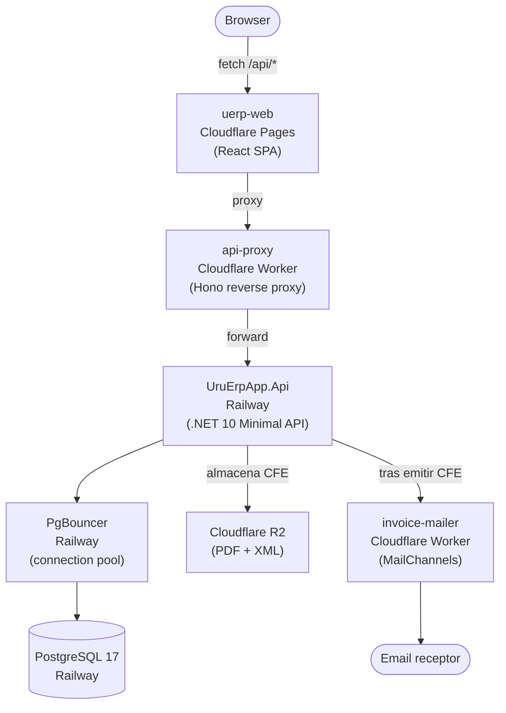
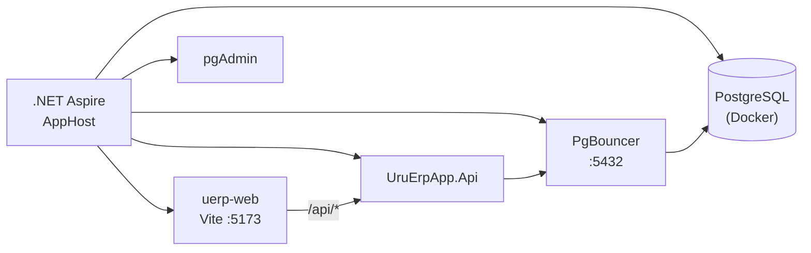
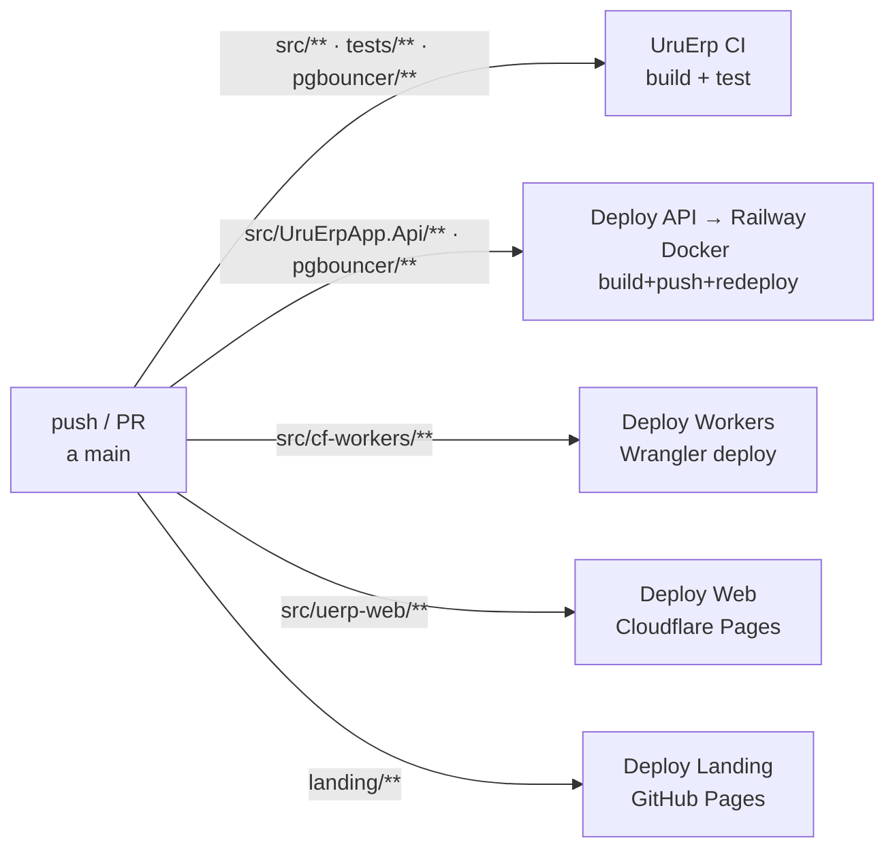

# UruErp

ERP multi-tenant construido sobre el **[UruFactura SDK](https://github.com/MathiasGonzalez/UruFacturaSDK/)**.  
Permite a múltiples empresas emitir, firmar y gestionar sus CFE (Comprobantes Fiscales Electrónicos) desde un único portal web.

## Stack

| Capa | Tecnología |
|------|-----------|
| Orquestación (dev) | .NET Aspire 9.5 |
| API | .NET 10 · Minimal API · EF Core 10 · JWT |
| Connection pool | PgBouncer 1.22 (Docker) |
| Base de datos | PostgreSQL 17 |
| Frontend | React 19 · Vite 6 |
| API Gateway | Cloudflare Workers · Hono 4 |
| Deploy API + PgBouncer | Railway (Docker) |
| Deploy Web | Cloudflare Pages |

## Arquitectura de producción



> **¿Por qué el proxy Worker?**  
> La URL de Railway nunca se expone al navegador. El Worker centraliza CORS y puede agregar rate-limiting sin tocar el backend.

> **¿Por qué PgBouncer?**  
> PgBouncer actúa como sidecar entre la API y PostgreSQL, poolando conexiones en modo `transaction`. La topología de desarrollo local (Aspire) replica exactamente la de producción.

## Estructura

```
UruErp/
├── pgbouncer/                ← imagen Docker del connection pooler
│   ├── Dockerfile
│   └── entrypoint.sh
└── src/
    ├── UruErpApp.AppHost/    ← orquestador Aspire (solo desarrollo local)
    ├── UruErpApp.Api/        ← API REST multi-tenant
    │   └── Dockerfile        ← imagen para Railway
    ├── uerp-web/             ← SPA React + Vite
    ├── cf-workers/
    │   ├── api-proxy/        ← Hono reverse proxy
    │   └── invoice-mailer/   ← Worker de email (MailChannels)
    └── README.md
```

## Funcionalidades

- **Registro / Login** – JWT, 30 días de expiración.
- **Multi-tenant** – comprobantes aislados por empresa.
- **Dashboard** – KPIs: total de comprobantes, ingresos, últimos 7 días.
- **Crear CFE** – e-Ticket, e-Factura, Notas de Crédito/Débito, Exportación, Remito.
- **Modo Demo** – ciclo de vida completo (emisión + anulación con NC).
- **Historial** – tabla con descarga de PDF A4 desde Cloudflare R2.
- **Config Status** – valida certificado y datos del emisor en tiempo real.
- **Email de comprobante** – `invoice-mailer` envía email HTML al receptor.

---

## Desarrollo local con Aspire

### Pre-requisitos

| Herramienta | Versión mínima |
|-------------|----------------|
| .NET SDK | 10.0 |
| Node.js | 20 LTS |
| Docker | 24+ |
| Aspire workload | `dotnet workload install aspire` |

### Topología local (Aspire)



### Certificado digital

```bash
# Certificado autofirmado para pruebas locales
openssl req -x509 -newkey rsa:2048 -keyout key.pem -out cert.pem -days 365 -nodes -subj "/CN=demo"
openssl pkcs12 -export -out src/UruErpApp.Api/certs/demo.pfx -inkey key.pem -in cert.pem -passout pass:demo123
```

Ajusta `UruFactura:PasswordCertificado` en `appsettings.json`.

### Iniciar

```bash
dotnet run --project src/UruErpApp.AppHost
```

Aspire levanta PostgreSQL, PgBouncer, la API y el frontend.  
Abre el Dashboard de Aspire para ver las URLs asignadas.  
En desarrollo, Vite proxea `/api/*` directo a la API; no es necesario levantar el Worker `api-proxy`.

---

## Despliegue en producción

### CI/CD con GitHub Actions



| Workflow | Archivo | Trigger |
|----------|---------|---------|
| UruErp CI | `uerp-ci.yml` | push/PR a `main` en `src/**`, `tests/**`, `pgbouncer/**` |
| Deploy API → Railway | `deploy-api-railway.yml` | push a `main` en `src/UruErpApp.Api/**`, `pgbouncer/**` |
| Deploy Workers | `deploy-workers.yml` | push a `main` en `src/cf-workers/**` |
| Deploy Web | `deploy-web-cloudflare.yml` | push a `main` en `src/uerp-web/**` |
| Deploy Landing | `deploy-pages.yml` | push a `main` en `landing/**` |
| Provision Railway DB | `provision-railway-db.yml` | Manual (one-shot) |

#### Secrets de GitHub necesarios

| Secret | Workflow |
|--------|---------|
| `RAILWAY_TOKEN` | deploy-api-railway |
| `RAILWAY_SERVICE_ID` | deploy-api-railway (API) |
| `RAILWAY_PGBOUNCER_SERVICE_ID` | deploy-api-railway (PgBouncer) |
| `DOCKER_USERNAME` | deploy-api-railway |
| `DOCKER_PASSWORD` | deploy-api-railway |
| `CF_API_TOKEN` | deploy-workers, deploy-web-cloudflare |
| `CF_ACCOUNT_ID` | deploy-workers, deploy-web-cloudflare |
| `UPSTREAM_API_URL` | deploy-workers (api-proxy) |
| `VITE_API_URL` | deploy-web-cloudflare |

**Variable** (no secret): `CF_PAGES_PROJECT` – nombre del proyecto en Cloudflare Pages.

---

### 1. API + PgBouncer → Railway

1. Crea un proyecto en [railway.app](https://railway.app).
2. Agrega un servicio **PostgreSQL** (plugin oficial).
3. Agrega un servicio **Docker** para la API:
   - Dockerfile: `src/UruErpApp.Api/Dockerfile`
4. Agrega un segundo servicio **Docker** para PgBouncer:
   - Dockerfile: `pgbouncer/Dockerfile`
   - `DATABASE_URL` = referencia a `${{Postgres.DATABASE_URL}}`
5. En la API, apunta `DATABASE_URL` al dominio privado de PgBouncer:  
   `postgresql://user:pass@${{PgBouncer.RAILWAY_PRIVATE_DOMAIN}}:5432/db`

#### Variables – Railway API

| Variable | Descripción |
|----------|-------------|
| `DATABASE_URL` | URL de PgBouncer (dominio privado Railway) |
| `Jwt__Secret` | Cadena aleatoria ≥ 32 chars (`openssl rand -hex 32`) |
| `AllowedOrigins` | URL del Worker `api-proxy` |
| `UruFactura__RutEmisor` | RUT del emisor |
| `UruFactura__RazonSocialEmisor` | Razón social |
| `UruFactura__DomicilioFiscal` | Domicilio fiscal |
| `UruFactura__Ciudad` | Ciudad |
| `UruFactura__Departamento` | Departamento |
| `UruFactura__Ambiente` | `Homologacion` o `Produccion` |
| `UruFactura__RutaCertificado` | Ruta al `.pfx` en el contenedor |
| `UruFactura__PasswordCertificado` | Password del `.pfx` |
| `CloudflareR2__AccountId` | Cloudflare account ID (opcional) |
| `CloudflareR2__BucketName` | Bucket R2 (default: `uruerp-invoices`) |
| `CloudflareR2__AccessKeyId` | Access key R2 |
| `CloudflareR2__SecretAccessKey` | Secret key R2 |
| `CloudflareR2__PublicBaseUrl` | URL pública R2 (opcional) |
| `InvoiceMailer__WorkerUrl` | URL del Worker `invoice-mailer` |
| `InvoiceMailer__ApiSecret` | Secret compartido con el Worker |

> **Certificado en Railway:** monta el `.pfx` como Railway Volume en `/app/certs/`. No incluyas el archivo en la imagen para producción.

---

### 2. Workers → Cloudflare

```bash
# api-proxy
cd src/cf-workers/api-proxy && npm ci
# Editar wrangler.toml: UPSTREAM_API_URL = URL de Railway
npm run deploy

# invoice-mailer
cd src/cf-workers/invoice-mailer && npm ci
wrangler secret put SENDER_EMAIL
wrangler secret put SENDER_NAME
wrangler secret put ALLOWED_API_SECRET
npm run deploy
```

| Variable | Worker | Descripción |
|----------|--------|-------------|
| `UPSTREAM_API_URL` | api-proxy | URL del backend Railway |
| `CORS_ORIGINS` | api-proxy | Orígenes permitidos (default: `*`) |
| `SENDER_EMAIL` | invoice-mailer | Dirección de envío |
| `SENDER_NAME` | invoice-mailer | Nombre del remitente |
| `ALLOWED_API_SECRET` | invoice-mailer | Secret compartido con la API |

---

### 3. Frontend → Cloudflare Pages

1. Crea un proyecto **Pages** en el dashboard de Cloudflare.
2. Variable de build: `VITE_API_URL` = URL del Worker `api-proxy`.  
   ⚠️ No apuntes directamente a Railway.
3. El workflow `deploy-web-cloudflare.yml` automatiza el deploy con cada push a `main`.

| Campo | Valor |
|-------|-------|
| Build command | `cd src/uerp-web && npm ci && npm run build` |
| Build output | `src/uerp-web/dist` |
| Node.js | `20` |

---

## API Endpoints

Base: `https://api-proxy.tu-cuenta.workers.dev`

| Método | Ruta | Auth | Descripción |
|--------|------|:----:|-------------|
| GET | `/health` | – | Health check |
| POST | `/api/auth/register` | – | Crea tenant + admin, retorna JWT |
| POST | `/api/auth/login` | – | Login, retorna JWT |
| GET | `/api/dashboard` | ✓ | KPIs del tenant |
| GET | `/api/cfe-types` | – | Lista tipos de CFE |
| GET | `/api/config/status` | ✓ | Estado del emisor |
| GET | `/api/invoices` | ✓ | Lista comprobantes |
| POST | `/api/invoices` | ✓ | Crea y firma un CFE |
| GET | `/api/invoices/{id}/pdf` | ✓ | Descarga PDF A4 |
| GET | `/api/invoices/{id}/r2-urls` | ✓ | URLs de descarga desde R2 |

Endpoints protegidos requieren `Authorization: Bearer <token>`.

---

## Notas

- Las migraciones SQL se aplican automáticamente al iniciar la API (`MigrationRunner`).
- El envío a DGI (`EnviarCfeAsync`) no está incluido; ver `UruFacturaClient` en el SDK.
- La DGI **no acepta** certificados autofirmados. Para homologación obtén el certificado oficial en [dgi.gub.uy](https://www.dgi.gub.uy).
